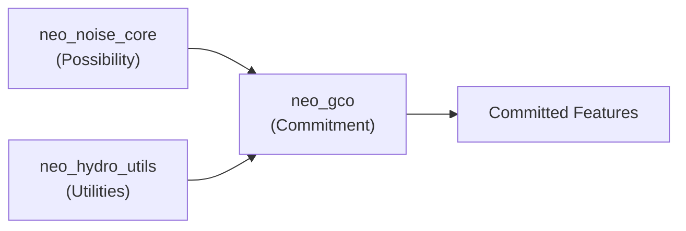

# Neo Noise Module Index

> Reference guide for Neo Noise codebase structure.

## Folder Structure

```
Neo Noise/
├── src/                   # PRODUCTION CODE
│   ├── neo_noise_core.py      # Base noise generation
│   ├── neo_gco.py             # Global Closure Operator
│   ├── neo_hydrology.py       # Particle erosion
│   ├── neo_hydro_utils.py     # Hydrology utilities (NEW)
│   ├── neo_biomes.py          # Biome classification
│   ├── neo_world.py           # Continental maps
│   └── neo_mesh_exporter.py   # 3D export
├── demos/                 # DEMO SCRIPTS
│   ├── neo_layer_generator.py # Full GCO pipeline demo
│   ├── neo_water_network.py   # Hydrology testing
│   ├── neo_noise_generator.py # Batch samples
│   └── ...
├── testing/               # UNIT TESTS
├── docs/                  # DOCUMENTATION
└── samples/               # OUTPUT
```

---

## Core Pipeline



**Flow**: Neo Noise generates possibility fields → GCO commits features (rivers, lakes, forests).

---

## Usage

```python
# From demos/ folder:
import sys, os
sys.path.insert(0, os.path.join(os.path.dirname(__file__), '..', 'src'))

import neo_noise_core as core
import neo_gco as gco
```
